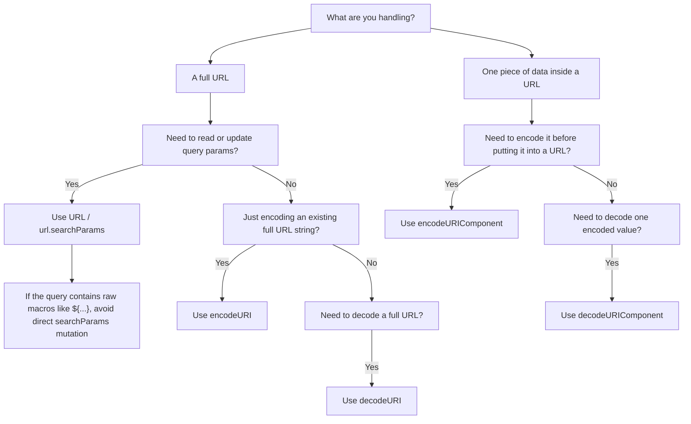

# 2026 Q1 Frontend Sharing

## URL Encoding Magic

Take a look at:

```
${}
```

What does this make you think of?

<br />

**Macro !**

<br />

Macros are sometimes placed in the URL's search params:

```
https://example.com/id436?a=${partner_ul}&b=${campaign_name}
```

<br />

One day, someone noticed that the URL had become like this:

```
https://example.com/id436?a=%24%7Bpartner_ul%7D&b=%24%7Bcampaign_name%7D
```

<br />

What happens when you try to access the URL using `new URL()`?

**Try it:**

1. [`1.js`](./1.js) - `new URL()`

```bash
node 1.js
```

2. [`2.js`](./2.js) - `searchParams.set()`

```bash
node 2.js
```

3. [`3.js`](./3.js) - `searchParams.append()`

```bash
node 3.js
```

4. [`4.js`](./4.js) - `searchParams.delete()`

```bash
node 4.js
```

5. [`5.js`](./5.js) - `searchParams.sort()`

```bash
node 5.js
```

6. [`6.js`](./6.js) - `searchParams.get()`

```bash
node 6.js
```

### Findings

- **`new URL()` alone is safe** — constructing a URL from a string with macros preserves them as-is, because the parser does not re-serialize the query string.
- **Any mutation triggers re-serialization** — `searchParams.set()`, `.append()`, `.delete()`, and `.sort()` all cause the entire query string to be re-encoded, turning `${macro}` into `%24%7Bmacro%7D`.
- **`searchParams.get()` is deceptive** — it always returns a percent-decoded value, so `${macro}` appears intact even after the URL has been corrupted. Always verify with `.toString()` or `.search` to see what actually gets sent.

---

### Why does this happen?

Imagine `set()` did not encode for us:

```js
url.searchParams.set("a", "hello&world");

// ?a=hello&world
```

This is interpreted as:

```js
{
  a: "hello",
  world: ""
}
```

But the intended meaning is:

```js
{
  a: "hello&world";
}
```

which should be encoded as:

```
https://example.com?a=hello%26world
```

---

### Related APIs

- `encodeURI`
- `encodeURIComponent`
- `decodeURI`
- `decodeURIComponent`

<br />

| API                  | Direction | Assumes input is |
| -------------------- | --------- | ---------------- |
| `encodeURI`          | Encode    | Full URL         |
| `encodeURIComponent` | Encode    | Single component |
| `decodeURI`          | Decode    | Full URL         |
| `decodeURIComponent` | Decode    | Single component |

<br />

**Try it:**

7. [`7.js`](./7.js) - `encodeURI` vs `encodeURIComponent`

```bash
node 7.js
```

8. [`8.js`](./8.js) - `decodeURI` vs `decodeURIComponent`

```bash
node 8.js
```

<br />

The `URI` pair (`encodeURI` / `decodeURI`) **skips** URI reserved characters. This preserves URL structure.

The `URIComponent` pair treats **everything** as data — all special characters are encoded/decoded.

| Char | Reserved? | `URI` pair      | `URIComponent` pair |
| ---- | --------- | --------------- | ------------------- |
| `$`  | Yes       | skipped         | encoded/decoded     |
| `&`  | Yes       | skipped         | encoded/decoded     |
| `=`  | Yes       | skipped         | encoded/decoded     |
| `{`  | No        | encoded/decoded | encoded/decoded     |
| `}`  | No        | encoded/decoded | encoded/decoded     |

<br />

9. [`9.js`](./9.js) - try to use `decodeURI` to recover the URL

```bash
node 9.js
```

---

### Why does `URLSearchParams` encode `$` but `encodeURI` does not?

<br />

**Try it:**

10. [`10.js`](./10.js) - `encodeURI` vs `URLSearchParams` on `$`

```bash
node 10.js
```

<br />

| Mechanism         | Spec                                | `$` encoded? |
| ----------------- | ----------------------------------- | ------------ |
| `encodeURI`       | RFC 3986 (URI)                      | No           |
| `URLSearchParams` | `application/x-www-form-urlencoded` | Yes          |

- `encodeURI` treats `$` as a **legal URI character** (`;/?:@&=+$,#`), so it leaves it alone.
- `URLSearchParams` uses **form encoding**, which only allows `A-Z a-z 0-9 - _ . *` unencoded. Everything else — including `$` — is percent-encoded.

---

### `URLSearchParams != encodeURIComponent`

<br />

**Try it:**

11. [`11.js`](./11.js) - `encodeURIComponent` vs `URLSearchParams` on spaces

```bash
node 11.js
```

<br />

Both APIs are encoding data, but they follow different rules:

- `encodeURIComponent("hello world")` becomes `hello%20world`
- `URLSearchParams` serializes the same value as `hello+world`

This is another effect of `application/x-www-form-urlencoded`:

- spaces become `+`
- many other special characters become percent-encoded

So `URLSearchParams` is not just "calling `encodeURIComponent` for you" — it follows form-encoding semantics.

---

### When to use which?

These APIs fall into two categories:

**String-level** — `encodeURI`, `decodeURI`, `encodeURIComponent`, `decodeURIComponent`

**Structured-level** — `URL` / `URLSearchParams`

| API                  | Mindset         | Use for           |
| -------------------- | --------------- | ----------------- |
| `encodeURI`          | URL syntax      | Encode a full URL |
| `decodeURI`          | URL syntax      | Decode a full URL |
| `encodeURIComponent` | Data            | Encode a value    |
| `decodeURIComponent` | Data            | Decode a value    |
| `URLSearchParams`    | Structured data | Manipulate params |

<br />

**`encodeURI`** — "I have a full URL, just encode the illegal characters"

```js
encodeURI("https://example.com?q=hello world&lang=en");
// "https://example.com?q=hello%20world&lang=en"
```

**`encodeURIComponent`** — "This is data, make it safe to put inside a URL"

```js
const keyword = "hello&world";
const url = `https://example.com?q=${encodeURIComponent(keyword)}`;
// "https://example.com?q=hello%26world"
```

**`decodeURI`** — "Decode this URL, but don't break its structure"

```js
decodeURI("https://example.com?q=hello%20world&lang=en");
// "https://example.com?q=hello world&lang=en"
```

**`decodeURIComponent`** — "This is encoded data, fully restore it"

```js
decodeURIComponent("hello%26world");
// "hello&world"
```

**`URL` / `URLSearchParams`** — "I'm manipulating URL structure, not strings"

```js
const url = new URL("https://example.com");
url.searchParams.set("q", "hello&world");
url.toString();
// "https://example.com/?q=hello%26world"
```



---

### How to preserve macros when updating the search params?

#### Approach 1: String concatenation

```js
const result = `${url}&${extraParam}`;
```

**Pros**

- Avoid encoding issues — macros are never parsed
- Simple, no regex or placeholder logic

**Cons**

- Easy to misuse — e.g. forgetting `&`, double `?`, or appending to a URL without existing params
- Can only **append**
- No validation

---

#### Approach 2: Placeholder swap

Replace macros with safe placeholders before mutation, then restore them after.

```js
const raw = "https://example.com/id436?a=${partner_ul}&b=${campaign_name}";

// Step 1: Replace macros with placeholders
const placeholders = new Map();
let counter = 0;
const uniqueId = Math.random().toString(36).slice(2);
const toPlaceholder = (macro) => {
  const key = `__MACRO_${uniqueId}_${counter++}__`;
  placeholders.set(key, macro);
  return key;
};

const safeUrl = raw.replace(/\$\{[^}]+\}/g, toPlaceholder);

// Step 2: Mutate freely
const url = new URL(safeUrl);
// "https://example.com/id436?a=__MACRO_abc123_0__&b=__MACRO_abc123_1__"

url.searchParams.set("c", "extra_param");
url.searchParams.delete("b");

// Step 3: Restore macros
let final = url.toString();
for (const [key, value] of placeholders) {
  final = final.replace(key, value);
}

// "https://example.com/id436?a=${partner_ul}&c=extra_param"
```

---

### References

- [WHATWG URL Standard](https://url.spec.whatwg.org/)
- [RFC 3986 — Uniform Resource Identifier (URI): Generic Syntax](https://datatracker.ietf.org/doc/html/rfc3986)
- [ECMAScript spec — `encodeURI`](https://tc39.es/ecma262/#sec-encodeuri-uri)
- [ECMAScript spec — `encodeURIComponent`](https://tc39.es/ecma262/#sec-encodeuricomponent-uricomponent)
- [MDN — Percent-encoding](https://developer.mozilla.org/en-US/docs/Glossary/percent-encoding)
- [MDN — URLSearchParams](https://developer.mozilla.org/en-US/docs/Web/API/URLSearchParams)
